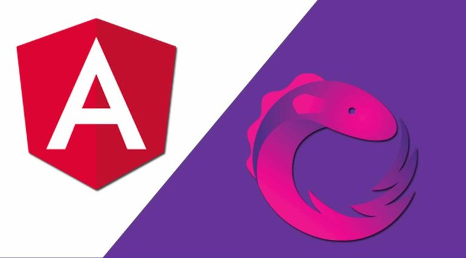

# Angular 9 + RxJS: 'Restaurangular' - website for a restaurant 

*March 2020*

> 🔨 Restaurant website. From Udemy '[Angular 6, Angular Material et RxJS 6 par la pratique](https://www.udemy.com/course/angular-6-angular-material-et-rxjs-6-par-la-pratique/)'. It covers the basics concepts of Angular and RxJS: materials, reactive forms, observables...

See the **demo** on [Github page]().

## 1. About

Restaurant website with menus, booking and scheduling of special evenings with a searchbar.

*Note:* the tutorial was for Angular 6 but this versions uses **Angular 9**.

## 2. How to use

### Local

- Clone the [local-version branch]()
- Tu run: 
- Open the app using [http://localhost:4200/](http://localhost:4200/)

### Online

See the **demo** on [Github page]().

## 3. Concepts covered

- Routes (RouterModule, Routes, Route)
- Modules / Components / Providers (app.module.ts: import {decorators} / NgModule)
- Material Data Table + Data source (using interfaces as models)
- Templates: Forms (Reactive forms, templates driven forms '#', structural directives '*': shape or reshape the DOM's structure), lifecycle hooks (OnInit), interpolation {{...}} / two way binding [()], ...
- Reactive Extensions Library for JavaScript (RxJS) and Observables, Operators, flux/push/callbacks, tap, map, switchMap, ...

## 4. Angular CLI

### CLI

This project was generated with [Angular CLI](https://github.com/angular/angular-cli) version 9.0.5.

https://angular.io/cli

~~~~
npm install -g @angular/cli
ng new my-first-project
cd my-first-project
~~~~

Run `ng serve` for a dev server. Navigate to `http://localhost:4200/`. The app will automatically reload if you change any of the source files.

#### -Code scaffolding

Run `ng generate component component-name` to generate a new component. You can also use `ng generate directive|pipe|service|class|guard|interface|enum|module`.

Ex: `ng g c Home` 

Run `ng generate services service-name` to generate a new service. 

Ex: `ng g s services/quick-lunch` 

#### -Build

Run `ng build` to build the project. The build artifacts will be stored in the `dist/` directory. Use the `--prod` flag for a production build.

#### -Running unit tests

Run `ng test` to execute the unit tests via [Karma](https://karma-runner.github.io).

#### -Running end-to-end tests

Run `ng e2e` to execute the end-to-end tests via [Protractor](http://www.protractortest.org/).

### Material

Angular Material module helps us to create high-quality UI applications with Angular framework by following Material Design specifications.

`ng add @angular/material`

Ex add component: `ng generate @angular/material:materialNav --name=main-nav`

## 5. Ressources

- [Angular Material](https://material.angular.io/)
- [List of External Library Angular Schematics](https://www.ngdevelop.tech/external-library-angular-schematics-list/)
- [Learn RxJS](https://www.learnrxjs.io/)
- [How to deploy Angular Apps to GitHub Pages (gh-pages)](https://medium.com/tech-insights/how-to-deploy-angular-apps-to-github-pages-gh-pages-896c4e10f9b4)